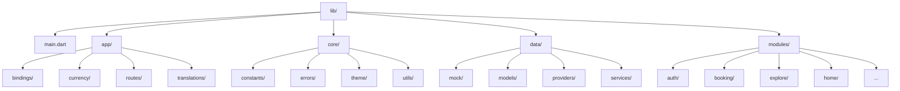

# JKWorlds App - Project Structure Documentation

This project is built with **Flutter** using the **GetX** state management library, structured following clean architecture guidelines with a modular presentation layer.



---

## Directory Overview

### 📁 `lib/app/`
Contains global application configurations, routes, and translations.
* **`bindings/`**: Global dependency injection bindings (e.g., initializing global services like `AuthService`, `BookingService`, etc. at launch).
* **`currency/`**: Reactive currency management service handles user-selected currency, symbols, and formatting/exchanging logic.
* **`routes/`**: Contains route definition constants (`app_routes.dart`) and the visual page setup mappings (`app_pages.dart`) for navigation.
* **`translations/`**: App translation localization keys (`app_translations.dart`) and translation resource maps for multi-language support.

### 📁 `lib/core/`
Houses application-wide constants, exceptions, styles, and reusable utilities.
* **`constants/`**: Holds API endpoint constants (`api_constants.dart`), color constants, asset images, and network configurations.
* **`errors/`**: Unified exception models (e.g., `ServerException`, `NetworkException`, `AppException`) for cohesive try-catch handling.
* **`theme/`**: Theme configuration schemas including custom `ColorScheme` configurations, dark/light theme definitions, and typography specs.
* **`utils/`**: Shared static utility classes and extensions, such as `SnackbarHelper`, `Logger`, date/time formatters, validation utilities, and image pickers.

### 📁 `lib/data/`
Acts as the central Data Layer of the application, interfacing with APIs and local databases.
* **`mock/`**: Stubs and local mock databases used for early staging, testing, and offline previews.
* **`models/`**: Serialization-ready entity models (e.g., `VehicleModel`, `BookingModel`, `ReviewModel`, `CheckoutPricingModel`) converting server JSON arrays into typed Dart structures.
* **`providers/`**: Network communication abstraction (`ApiProvider` utilizing the `Dio` library) that registers interceptors, base URLs, headers, and authentication tokens.
* **`services/`**: Feature-level business services (e.g., `AuthService`, `BookingService`, `LocationService`) implementing remote data fetching and local persistence.

### 📁 `lib/modules/`
The Presentation Layer, organized as **GetX Feature Modules**. Each module represents a screen or flow, typically containing:
1. `*_controller.dart`: GetX controller managing local reactive variables and screen events.
2. `*_view.dart`: StatelessWidget mapping reactive variables to Material Design components.
3. `*_binding.dart` (optional): Injector class registering feature controllers when navigating to that page.

#### Active Feature Modules:
* **`auth/`**: Standard signup, credentials login, OTP verification, and password recovery screens.
* **`booking/`**: Reservation configuration flows, checkout forms, payment processing gateways, and promo codes.
* **`booking_detail/`**: Timeline progress visualizers and complete booking specifications logs.
* **`explore/`**: Vehicle catalog with complex search bars, category filters, and location prediction widgets.
* **`home/`**: Dashboard landing page showcasing categories, featured lists, and search entries.
* **`main_nav/`**: Shell controller orchestrating bottom bar navigation tabs persistently.
* **`onboarding/`**: Introductory welcome slider layouts shown to first-time installs.
* **`orders/`**: Active bookings and historical list grids.
* **`preferences/`**: User settings view controlling default localization preferences.
* **`profile/`**: User detailed account updates, damage reporting tools, and rating widgets.
* **`splash/`**: Welcome animation page determining auto-routing logic based on auth checks.
* **`static_pages/`**: Simple descriptive screens (About Us, privacy policies, licensing).
* **`support_tickets/`**: Multi-agent support ticket messaging threads and chat channels.
* **`vehicle_detail/`**: Detailed specs, image galleries, calendar selectors, protection models, and pricing calculators.

---

## Architecture Flow

The project follows a standard **reactive data flow** built around GetX controllers:

```
  ┌────────────────────────────────────────────────────────┐
  │                        View                            │
  │  (Renders UI, reacts to Controller states via Obx)     │
  └───────────┬────────────────────────────────┬───────────┘
              │ (user action)                  │ (observes)
              ▼                                ▼
  ┌────────────────────────────────────────────────────────┐
  │                     Controller                         │
  │  (Manages page state, triggers fetch flows)            │
  └───────────┬────────────────────────────────▲───────────┘
              │ (calls)                        │ (returns model)
              ▼                                │
  ┌────────────────────────────────────────────┴───────────┐
  │                      Service                           │
  │  (Executes business validation, coordinates data)       │
  └───────────┬────────────────────────────────▲───────────┘
              │ (requests)                     │ (returns JSON)
              ▼                                │
  ┌────────────────────────────────────────────┴───────────┐
  │                 ApiProvider / Mock                     │
  │  (Fetches from Remote Server or Mock stubs)            │
  └────────────────────────────────────────────────────────┘
```
