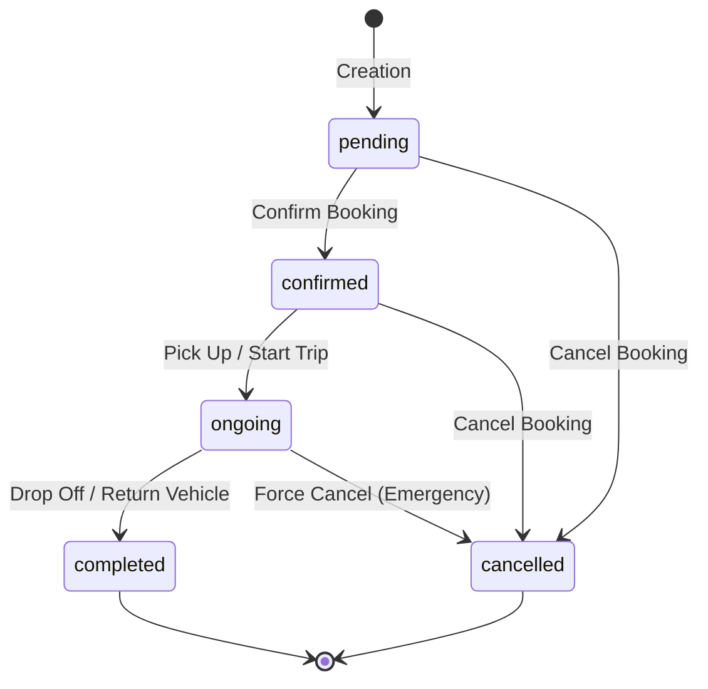

# JKWORLDS Booking API Documentation

This document describes the API endpoints and resources available for managing and retrieving vehicle bookings. All bookings endpoints are scoped to the authenticated user's session.

---

## Authentication

All endpoints under the `/bookings` path require authentication. The API uses Laravel Sanctum for secure token-based authentication.

### Authorization Header
Include the following header with all requests:
```http
Authorization: Bearer <your_access_token>
Accept: application/json
```

If the authorization token is missing, invalid, or expired, the backend returns:
* Status Code: `401 Unauthorized`
* Content-Type: `application/json`

---

## Data Models and Enums

### Booking Enums

#### `BookingStatus` (string)
Indicates the current operational state of the booking.
* `pending`: The booking is created and awaiting confirmation or payment verification.
* `confirmed`: The booking has been approved and scheduled.
* `ongoing`: The trip is currently active (vehicle is picked up).
* `completed`: The vehicle has been returned and the trip is successfully finished.
* `cancelled`: The booking was cancelled by the user or system administrator.



#### `BookingType` (string)
Classifies the service mode of the booking.
* `car_rental`: Standard rental where the client rents a vehicle.
* `airport_transfer`: Point-to-point transfer service to or from an airport.

#### `RentalType` (string)
Indicates if the client drives themselves or hires a chauffeur.
* `self_drive`: The client drives the vehicle themselves.
* `chauffeur`: A professional driver is assigned to pilot the vehicle.

#### `DriverTripStatus` (string)
Tracks the driver's real-time journey lifecycle.
* `accepted`: Driver accepted the assignment.
* `on_the_way`: Driver is driving to the pickup location.
* `arrived`: Driver arrived at the pickup location.
* `started`: Trip is active.
* `completed`: Trip completed.

---

## Endpoint Reference

### 1. List User Bookings
Retrieve a paginated list of bookings associated with the authenticated user.

* **URL:** `/api/bookings`
* **Method:** `GET`
* **Headers:**
  * `Authorization: Bearer <token>`
  * `Accept: application/json`

#### Query Parameters
| Parameter | Type | Required | Description | Example |
| :--- | :--- | :--- | :--- | :--- |
| `status` | string | Optional | Filter by booking status (`pending`, `confirmed`, `ongoing`, `completed`, `cancelled`) | `confirmed` |
| `booking_type` | string | Optional | Filter by booking type (`car_rental`, `airport_transfer`) | `car_rental` |
| `per_page` | integer | Optional | Number of items to return per page (default: `15`) | `10` |

#### Response Format (200 OK)
```json
{
  "status": true,
  "message": "Bookings fetched successfully.",
  "data": [
    {
      "id": 104,
      "booking_code": "JKW-2026-0004",
      "status": {
        "value": "confirmed",
        "label": "Confirmed",
        "badge_class": "info"
      },
      "booking_type": {
        "value": "car_rental",
        "label": "Car Rental"
      },
      "rental_type": {
        "value": "self_drive",
        "label": "Self Drive"
      },
      "pickup": {
        "address": "Terminal 1, Dubai International Airport (DXB), Dubai, UAE",
        "latitude": 25.2532,
        "longitude": 55.3657,
        "datetime": "2026-07-01T10:00:00+04:00",
        "datetime_formatted": "Jul 01, 2026 10:00 AM"
      },
      "dropoff": {
        "address": "Dubai Mall, Downtown Dubai, Dubai, UAE",
        "latitude": 25.1972,
        "longitude": 55.2797,
        "datetime": "2026-07-05T18:00:00+04:00",
        "datetime_formatted": "Jul 05, 2026 06:00 PM"
      },
      "return_different_location": true,
      "customer": {
        "name": "Jane Doe",
        "email": "jane.doe@example.com",
        "phone": "+971501234567"
      },
      "driver": null,
      "vehicle": {
        "id": 12,
        "slug": "lamborghini-urus-2024",
        "title": "Lamborghini Urus 2024",
        "brand": "Lamborghini",
        "model": "Urus",
        "year": 2024,
        "plate_number": "DXB-A-9999",
        "image": "http://localhost:8000/storage/vehicles/urus-primary.png",
        "is_featured": true,
        "service_type": "self_drive",
        "service_type_label": "Self Drive",
        "specs": {
          "seats": 5,
          "doors": 4,
          "transmission": "auto",
          "transmission_label": "Automatic",
          "fuel_type": "petrol",
          "fuel_type_label": "Petrol",
          "mileage": 12000
        },
        "rating": {
          "average": 4.9,
          "count": 28
        },
        "pricing": {
          "daily_rate": 2500,
          "daily_rate_formatted": "AED 2,500.00",
          "total_price": 10000,
          "total_price_formatted": "AED 10,000.00",
          "currency": "AED"
        },
        "created_at": "2026-01-15T08:00:00Z",
        "updated_at": "2026-06-20T12:00:00Z"
      },
      "protection_plan": {
        "title": "Premium Comprehensive Plan",
        "price_type": "daily",
        "price_value": 150.00,
        "amount": 600.00,
        "amount_formatted": "AED 600.00"
      },
      "pricing": {
        "currency": "AED",
        "base_amount": 10000.00,
        "base_amount_formatted": "AED 10,000.00",
        "addons_total": 200.00,
        "addons_total_formatted": "AED 200.00",
        "protection_plan_amount": 600.00,
        "protection_plan_amount_formatted": "AED 600.00",
        "discount_amount": 500.00,
        "discount_amount_formatted": "AED 500.00",
        "deposit_amount": 2500.00,
        "deposit_amount_formatted": "AED 2,500.00",
        "total_amount": 10300.00,
        "total_amount_formatted": "AED 10,300.00",
        "payable_amount": 10300.00,
        "payable_amount_formatted": "AED 10,300.00"
      },
      "payment": {
        "method": "stripe",
        "status": "paid",
        "paid_at": "2026-06-22T20:30:00+06:00",
        "paid_at_formatted": "Jun 22, 2026 08:30 PM"
      },
      "coupon_code": "PROMO500",
      "flight_number": "EK203",
      "notes": "Keep the car detailed.",
      "special_requests": "Need child seat",
      "timestamps": {
        "confirmed_at": "2026-06-22T20:31:00+06:00",
        "confirmed_at_formatted": "Jun 22, 2026 08:31 PM",
        "cancelled_at": null,
        "cancelled_at_formatted": null,
        "completed_at": null,
        "completed_at_formatted": null,
        "created_at": "2026-06-22T20:28:00+06:00",
        "updated_at": "2026-06-22T20:31:00+06:00"
      }
    }
  ],
  "links": {
    "first": "http://localhost:8000/api/bookings?page=1",
    "last": "http://localhost:8000/api/bookings?page=1",
    "prev": null,
    "next": null
  },
  "meta": {
    "current_page": 1,
    "from": 1,
    "last_page": 1,
    "links": [
      {
        "url": null,
        "label": "&laquo; Previous",
        "active": false
      },
      {
        "url": "http://localhost:8000/api/bookings?page=1",
        "label": "1",
        "active": true
      },
      {
        "url": null,
        "label": "Next &raquo;",
        "active": false
      }
    ],
    "path": "http://localhost:8000/api/bookings",
    "per_page": 15,
    "to": 1,
    "total": 1
  }
}
```

---

### 2. Get Booking Details
Retrieve comprehensive information about a specific booking by its ID.

* **URL:** `/api/bookings/{id}`
* **Method:** `GET`
* **Headers:**
  * `Authorization: Bearer <token>`
  * `Accept: application/json`

#### Path Parameters
| Parameter | Type | Required | Description |
| :--- | :--- | :--- | :--- |
| `id` | integer | Yes | The database ID of the booking to retrieve. |

#### Response Format (200 OK)
When successful, this endpoint returns the full `BookingResource` detailing addons, vehicle category/features, customer details, and the assigned driver (if applicable).

```json
{
  "status": true,
  "message": "Booking fetched successfully.",
  "data": {
    "id": 104,
    "booking_code": "JKW-2026-0004",
    "status": {
      "value": "confirmed",
      "label": "Confirmed",
      "badge_class": "info"
    },
    "booking_type": {
      "value": "car_rental",
      "label": "Car Rental"
    },
    "rental_type": {
      "value": "self_drive",
      "label": "Self Drive"
    },
    "pickup": {
      "address": "Terminal 1, Dubai International Airport (DXB), Dubai, UAE",
      "latitude": 25.2532,
      "longitude": 55.3657,
      "datetime": "2026-07-01T10:00:00+04:00",
      "datetime_formatted": "Jul 01, 2026 10:00 AM"
      },
    "dropoff": {
      "address": "Dubai Mall, Downtown Dubai, Dubai, UAE",
      "latitude": 25.1972,
      "longitude": 55.2797,
      "datetime": "2026-07-05T18:00:00+04:00",
      "datetime_formatted": "Jul 05, 2026 06:00 PM"
    },
    "return_different_location": true,
    "customer": {
      "name": "Jane Doe",
      "email": "jane.doe@example.com",
      "phone": "+971501234567"
    },
    "driver": {
      "id": 8,
      "name": "Ahmed Al-Mansoori",
      "email": "ahmed.driver@jkworlds.com",
      "phone": "+971509998877"
    },
    "vehicle": {
      "id": 12,
      "slug": "lamborghini-urus-2024",
      "title": "Lamborghini Urus 2024",
      "brand": "Lamborghini",
      "model": "Urus",
      "year": 2024,
      "plate_number": "DXB-A-9999",
      "image": "http://localhost:8000/storage/vehicles/urus-primary.png",
      "is_featured": true,
      "service_type": "self_drive",
      "service_type_label": "Self Drive",
      "category": {
        "id": 3,
        "name": "Supercar SUV",
        "slug": "supercar-suv"
      },
      "specs": {
        "seats": 5,
        "doors": 4,
        "transmission": "auto",
        "transmission_label": "Automatic",
        "fuel_type": "petrol",
        "fuel_type_label": "Petrol",
        "mileage": 12000
      },
      "rating": {
        "average": 4.9,
        "count": 28
      },
      "pricing": {
        "daily_rate": 2500,
        "daily_rate_formatted": "AED 2,500.00",
        "total_price": 10000,
        "total_price_formatted": "AED 10,000.00",
        "currency": "AED"
      },
      "features": [
        {
          "id": 1,
          "name": "GPS Navigation",
          "icon": "http://localhost:8000/assets/icons/gps.svg"
        },
        {
          "id": 5,
          "name": "Bluetooth Audio",
          "icon": "http://localhost:8000/assets/icons/bluetooth.svg"
        }
      ],
      "created_at": "2026-01-15T08:00:00Z",
      "updated_at": "2026-06-20T12:00:00Z"
    },
    "protection_plan": {
      "title": "Premium Comprehensive Plan",
      "price_type": "daily",
      "price_value": 150.00,
      "amount": 600.00,
      "amount_formatted": "AED 600.00"
    },
    "pricing": {
      "currency": "AED",
      "base_amount": 10000.00,
      "base_amount_formatted": "AED 10,000.00",
      "addons_total": 200.00,
      "addons_total_formatted": "AED 200.00",
      "protection_plan_amount": 600.00,
      "protection_plan_amount_formatted": "AED 600.00",
      "discount_amount": 500.00,
      "discount_amount_formatted": "AED 500.00",
      "deposit_amount": 2500.00,
      "deposit_amount_formatted": "AED 2,500.00",
      "total_amount": 10300.00,
      "total_amount_formatted": "AED 10,300.00",
      "payable_amount": 10300.00,
      "payable_amount_formatted": "AED 10,300.00"
    },
    "payment": {
      "method": "stripe",
      "status": "paid",
      "paid_at": "2026-06-22T20:30:00+06:00",
      "paid_at_formatted": "Jun 22, 2026 08:30 PM"
    },
    "coupon_code": "PROMO500",
    "flight_number": "EK203",
    "notes": "Keep the car detailed.",
    "special_requests": "Need child seat",
    "rental_addons": [
      {
        "id": 1,
        "title": "Child Safety Seat",
        "price_type": "daily",
        "price_value": 50.00,
        "amount": 200.00,
        "amount_formatted": "AED 200.00"
      }
    ],
    "timestamps": {
      "confirmed_at": "2026-06-22T20:31:00+06:00",
      "confirmed_at_formatted": "Jun 22, 2026 08:31 PM",
      "cancelled_at": null,
      "cancelled_at_formatted": null,
      "completed_at": null,
      "completed_at_formatted": null,
      "created_at": "2026-06-22T20:28:00+06:00",
      "updated_at": "2026-06-22T20:31:00+06:00"
    }
  }
}
```

#### Error Response Format (404 Not Found)
If the booking does not exist or does not belong to the authenticated user:
* **Status Code:** `404 Not Found`
```json
{
  "status": false,
  "message": "Booking not found.",
  "data": null
}
```

---

## HTTP Status Codes Reference

The API uses standard HTTP response codes to indicate success or failure:

| Status Code | Description | Reason / Occurrence |
| :--- | :--- | :--- |
| `200 OK` | Request succeeded | The resources are returned successfully. |
| `401 Unauthorized` | Authentication failed | Missing or invalid Sanctum access token. |
| `404 Not Found` | Resource not found | Booking ID doesn't exist or is not owned by the user. |
| `500 Server Error` | Unexpected backend error | A system error occurred. Please contact backend support. |
