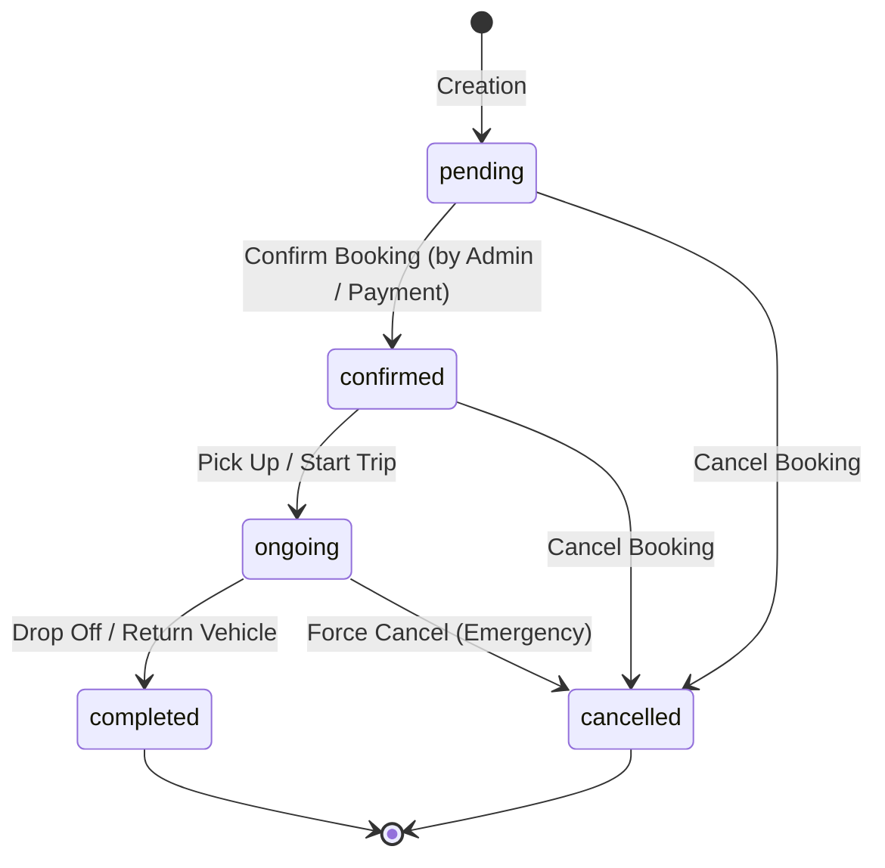

# JKWORLDS Booking and Checkout API Documentation

This document describes the API endpoints and resources available for calculating checkout pricing, initiating bookings, managing payments, and retrieving vehicle bookings. All bookings endpoints are scoped to the authenticated user's session unless executing a guest checkout flow.

---

## Authentication and Global Headers

All endpoints require standard API headers. Most checkout and payment flow endpoints support guest checkout (by omitting the authentication token) but will associate the booking with the user when a token is provided. Retrieving user booking lists and details explicitly requires user authentication.

### Global Headers

| Header | Required | Service Scope | Description |
| :--- | :--- | :--- | :--- |
| `Accept` | Yes (Must be `application/json`) | All | Forces the backend to return standard JSON responses. |
| `Authorization` | Optional / Required | Booking retrieval, Checkout/Booking | Laravel Sanctum token (`Bearer <your_access_token>`). Required for listing/details endpoints. Optional for checkout and payment flows; if present, links the booking to the authenticated user's account. |
| `Currency` | Optional (default: `USD` or system default) | Checkout/Booking, Distance, Details | Converted ISO code (e.g. `USD`, `EUR`, `GBP`, `AED`, `BDT`, `NGN`). Converted amounts are returned and charged in this currency. If unsupported by the gateway, the gateway will be disabled. |
| `Service-Type` | Optional (default: `self_drive`) | Checkout/Booking, Details | `self_drive`, `chauffeur`, `airport_transfer`. Can also be sent as `service_type` in the request body. |

### Authentication Failure (401 Unauthorized)
If an endpoint requires authentication and the token is missing, invalid, or expired, the response is:
- Status Code: `401 Unauthorized`
- Body:
```json
{
  "message": "Unauthenticated."
}
```

---

## Data Models and Enums

### Enums

#### 1. `BookingStatus` (string)
Indicates the current operational state of the booking.
* `pending`: The booking is created and awaiting confirmation or payment verification.
* `confirmed`: The booking has been approved and scheduled.
* `ongoing`: The trip is currently active (vehicle is picked up).
* `completed`: The vehicle has been returned and the trip is successfully finished.
* `cancelled`: The booking was cancelled by the user or system administrator.

##### Allowed State Transitions


#### 2. `BookingType` (string)
Classifies the service mode of the booking.
* `car_rental`: Standard rental where the client rents a vehicle.
* `airport_transfer`: Point-to-point transfer service to or from an airport.

#### 3. `RentalType` (string)
Indicates if the client drives themselves or hires a chauffeur.
* `self_drive`: The client drives the vehicle themselves.
* `chauffeur`: A professional driver is assigned to pilot the vehicle.

#### 4. `DriverTripStatus` (string)
Tracks the driver's real-time journey lifecycle.
* `accepted`: Driver accepted the assignment.
* `on_the_way`: Driver is driving to the pickup location.
* `arrived`: Driver arrived at the pickup location.
* `started`: Trip is active.
* `completed`: Trip completed.

---

## Service-Type Rules Summary

| Service Type | Base Price | Driver | Drop-off Required | License Upload |
| :--- | :--- | :--- | :--- | :--- |
| `self_drive` | Tiered daily / weekly / monthly rates | Customer drives | No | **Yes** (required) |
| `chauffeur` | Daily rate + chauffeur daily rate | Included | Yes | No |
| `airport_transfer` | `distance_km × per_km_rate` (min 1 km) | Included | Yes | No |

---

## Endpoint Reference

### Flow Overview
For creating and confirming a booking:
1. **(Optional)** `/api/airport-transfer/distance` -> Check distance and estimate transfer fare.
2. `/api/checkout` -> Retrieve full pricing breakdown and available payment gateway configs.
3. `/api/bookings` -> Initiate a booking, upload the driver's license (for `self_drive`), and create a pending payment.
4. Client processes the in-app payment via the Stripe/PayPal/Flutterwave SDK using the credentials returned from step 3.
5. `/api/payments/{gateway}/success` or `/api/payments/{gateway}/cancel` -> Verify payment and finalize or cancel the booking.

---

### Booking & Checkout Flow Endpoints

#### 1. Airport Transfer Distance & Fare Preview
Retrieve distance calculation and a fare preview for an airport transfer. Uses a straight-line great-circle (haversine) formula, floored to a 1 km billable minimum.
* **URL:** `/api/airport-transfer/distance`
* **Method:** `POST`
* **Headers:**
  - `Accept: application/json`
  - `Currency: <ISO_CODE>` (Optional)
* **Request Body:**
```json
{
  "pickup_latitude": 9.0579,
  "pickup_longitude": 7.4951,
  "dropoff_latitude": 9.0765,
  "dropoff_longitude": 7.3986,
  "vehicle_id": 6
}
```
* **Parameters:**
  - `pickup_latitude` (numeric, required, between -90 and 90)
  - `pickup_longitude` (numeric, required, between -180 and 180)
  - `dropoff_latitude` (numeric, required, between -90 and 90)
  - `dropoff_longitude` (numeric, required, between -180 and 180)
  - `vehicle_id` (integer, optional) - When provided, returns the calculated fare.
* **Response (200 OK):**
```json
{
  "status": true,
  "message": "Distance calculated successfully.",
  "data": {
    "currency": "USD",
    "distance": {
      "method": "haversine",
      "raw_km": 10.8,
      "billable_km": 10.8,
      "min_billable_km": 1
    },
    "fare": {
      "vehicle_id": 6,
      "per_km_rate": {
        "amount": 10,
        "amount_formatted": "$10.00"
      },
      "base_fare": {
        "label": "Transfer fare (10.8 km × $10.00)",
        "amount": 108,
        "amount_formatted": "$108.00"
      },
      "taxes_fees": [
        {
          "title": "VAT",
          "amount": 8.64,
          "amount_formatted": "$8.64"
        }
      ],
      "taxes_fees_total": {
        "amount": 8.64,
        "amount_formatted": "$8.64"
      },
      "estimated_total": {
        "amount": 116.64,
        "amount_formatted": "$116.64"
      }
    }
  }
}
```

---

#### 2. Checkout Pricing Breakdown
Calculate a full pricing breakdown and get available payment methods without persisting any data.
* **URL:** `/api/checkout`
* **Method:** `POST`
* **Headers:**
  - `Accept: application/json`
  - `Currency: <ISO_CODE>` (Optional)
  - `Service-Type: <type>` (Optional)
* **Request Body:**
```json
{
  "vehicle_id": 1,
  "service_type": "self_drive",
  "pickup_date": "2026-07-16",
  "pickup_time": "10:00",
  "return_date": "2026-07-20",
  "return_time": "10:00",
  "pickup_latitude": 9.0579,
  "pickup_longitude": 7.4951,
  "protection_plan_id": 3,
  "addon_ids": [2],
  "coupon_code": "WELCOME10"
}
```
* **Body Parameters:**
  - `vehicle_id` (integer, required) - ID of active vehicle.
  - `service_type` (string, optional) - `self_drive`, `chauffeur`, `airport_transfer`.
  - `pickup_date` (date string, required, YYYY-MM-DD).
  - `pickup_time` (time string, required, HH:mm 24h format).
  - `return_date` (date string, required unless `service_type` is `airport_transfer`, after or equal to `pickup_date`).
  - `return_time` (time string, optional, defaults to `23:59`).
  - `pickup_latitude` / `pickup_longitude` (numeric, required).
  - `dropoff_latitude` / `dropoff_longitude` (numeric, required for `chauffeur` and `airport_transfer`).
  - `pickup_location_name` / `pickup_address` (string, optional).
  - `dropoff_location_name` / `dropoff_address` (string, required for `chauffeur` and `airport_transfer`).
  - `protection_plan_id` (integer, optional) - Must belong to the vehicle.
  - `addon_ids` (array of integers, optional) - IDs must belong to the vehicle.
  - `additional_driver` (boolean, optional) - Ignored for `chauffeur` & `airport_transfer`.
  - `coupon_code` (string, optional).
* **Response (200 OK):**
```json
{
  "status": true,
  "message": "Checkout pricing calculated successfully.",
  "data": {
    "currency": "EUR",
    "service_type": "self_drive",
    "service_type_label": "Self Drive",
    "booking_type": "car_rental",
    "rental_days": 4,
    "distance_km": null,
    "per_km_rate": null,
    "base": {
      "label": "Base (4d)",
      "amount": 734.20,
      "amount_formatted": "€734.20"
    },
    "addons": [
      {
        "title": "Additional Driver",
        "amount": 91.80,
        "amount_formatted": "€91.80"
      }
    ],
    "addons_total": {
      "amount": 91.80,
      "amount_formatted": "€91.80"
    },
    "protection": {
      "title": "Basic Protection",
      "amount": 0,
      "amount_formatted": "€0.00"
    },
    "fees": [
      {
        "title": "VAT",
        "amount": 7.35,
        "amount_formatted": "€7.35"
      }
    ],
    "fees_total": {
      "amount": 12.30,
      "amount_formatted": "€12.30"
    },
    "discount": {
      "code": "WELCOME10",
      "amount": 73.42,
      "amount_formatted": "€73.42"
    },
    "subtotal": {
      "amount": 826.00,
      "amount_formatted": "€826.00"
    },
    "total": {
      "amount": 838.30,
      "amount_formatted": "€838.30"
    },
    "payable_total": {
      "amount": 764.88,
      "amount_formatted": "€764.88"
    },
    "deposit": {
      "amount": 459.00,
      "amount_formatted": "€459.00"
    },
    "vehicle": {
      "id": 1,
      "slug": "toyota-camry-2023",
      "title": "Toyota Camry 2023",
      "brand": "Toyota",
      "model": "Camry",
      "type": "Sedan",
      "image": "http://localhost:8000/storage/vehicles/camry.png"
    },
    "payment_methods": [
      {
        "key": "stripe",
        "label": "Stripe",
        "subtitle": "Credit / Debit Card",
        "icon": "http://localhost:8000/assets/payment/stripe.png",
        "public_key": "pk_test_...",
        "mode": "test",
        "currencies": ["USD", "EUR", "GBP", "AED", "BDT"],
        "enabled": true
      }
    ]
  }
}
```

---

#### 3. Initiate Booking
Create a pending payment record and obtain payment gateway config details for the mobile SDK client. Accepts same body parameters as `/checkout` plus client information.
* **URL:** `/api/bookings`
* **Method:** `POST`
* **Headers:**
  - `Accept: application/json`
  - `Currency: <ISO_CODE>` (Optional)
  - `Authorization: Bearer <token>` (Optional)
* **Request Body (multipart/form-data):**
  Includes checkout pricing payload parameters, plus:
  - `full_name` (string, required) - Ignored if user authenticated.
  - `email` (string, email format, required).
  - `phone` (string, required, regex validated format).
  - `driver_license` (file, required for `self_drive`, mimes: jpg, jpeg, png, webp, pdf, max: 5120 KB).
  - `flight_number` (string, optional).
  - `special_requests` (string, optional).
  - `payment_method` (string, required) - One of `stripe`, `paypal`, `flutterwave` (must support the requested currency).
* **Response (200 OK - Stripe example):**
```json
{
  "status": true,
  "message": "Booking initiated. Complete the payment to confirm.",
  "data": {
    "reference": "MOB-20260625120000-AB12CD34",
    "status": "pending",
    "amount": 764.88,
    "currency": "EUR",
    "payment_method": "stripe",
    "gateway": {
      "type": "stripe",
      "publishable_key": "pk_test_...",
      "mode": "test",
      "payment_intent_id": "pi_3Q...",
      "client_secret": "pi_3Q..._secret_...",
      "amount": 764.88,
      "currency": "EUR"
    },
    "pricing": {
      "currency": "EUR",
      "total": { "amount": 838.30, "amount_formatted": "€838.30" },
      "payable_total": { "amount": 764.88, "amount_formatted": "€764.88" }
      // ... same pricing structure as /checkout
    }
  }
}
```

##### Per-Gateway `gateway` Configuration Object:
* **Stripe:** Contains `publishable_key`, `mode`, `payment_intent_id`, and `client_secret` (used to load Stripe Payment Sheet).
* **PayPal:** Contains `client_id`, `mode`, `order_id`, `amount`, and `currency` (used to approve orders with the PayPal SDK).
* **Flutterwave:** Contains `public_key`, `mode`, `tx_ref` (which matches the reference), `amount`, and `currency` (used with Flutterwave SDK callback).

---

#### 4. Confirm Payment (Finalize Booking)
Verify the transaction server-side and create the confirmed booking.
* **URL:** `/api/payments/{gateway}/success`
* **Method:** `POST`
* **Path Parameters:**
  - `gateway` (string, required) - `stripe`, `paypal`, or `flutterwave`.
* **Request Body:**
```json
{
  "reference": "MOB-20260625120000-AB12CD34",
  "transaction_id": "pi_3Q..."
}
```
* **Body Parameters:**
  - `reference` (string, required) - The `reference` returned by booking initiation.
  - `transaction_id` (string, required for `flutterwave`, optional for `stripe`/`paypal`) - Transaction reference from the client SDK callback.
* **Response (200 OK):**
```json
{
  "status": true,
  "message": "Payment confirmed and booking created successfully.",
  "data": {
    "id": 812,
    "booking_code": "BK-20260625-AB12CD",
    "status": "pending",
    "payment_status": "paid",
    "service_type": "self_drive",
    "currency": "EUR",
    "vehicle": {
      "id": 1,
      "title": "Toyota Camry 2023",
      "image": "http://localhost:8000/storage/vehicles/camry.png",
      "category": "Sedan"
    },
    "pickup": {
      "address": "Terminal 1, Dubai Airport",
      "datetime": "2026-07-16T10:00:00+04:00",
      "datetime_formatted": "Jul 16, 2026 10:00 AM"
    },
    "dropoff": {
      "address": "Dubai Mall",
      "datetime": "2026-07-20T10:00:00+04:00",
      "datetime_formatted": "Jul 20, 2026 10:00 AM"
    },
    "pricing": {
      "base": { "amount": 734.20, "amount_formatted": "€734.20" },
      "total": { "amount": 838.30, "amount_formatted": "€838.30" },
      "payable": { "amount": 764.88, "amount_formatted": "€764.88" },
      "deposit": { "amount": 459.00, "amount_formatted": "€459.00" }
    },
    "payment": {
      "reference": "MOB-20260625120000-AB12CD34",
      "gateway": "stripe",
      "status": "paid",
      "amount": 764.88,
      "currency": "EUR",
      "paid_at": "2026-06-25T12:01:30+00:00"
    }
  }
}
```

---

#### 5. Cancel Payment
Mark the pending payment as cancelled. No booking is created.
* **URL:** `/api/payments/{gateway}/cancel`
* **Method:** `POST`
* **Path Parameters:**
  - `gateway` (string, required) - `stripe`, `paypal`, or `flutterwave`.
* **Request Body:**
```json
{
  "reference": "MOB-20260625120000-AB12CD34"
}
```
* **Response (200 OK):**
```json
{
  "status": true,
  "message": "Payment was cancelled. Your booking was not created.",
  "data": {
    "reference": "MOB-20260625120000-AB12CD34",
    "status": "cancelled"
  }
}
```

---

### v1 User Bookings Management Endpoints (Auth Required)

#### 6. List User Bookings
Retrieve a paginated list of bookings associated with the authenticated user.
* **URL:** `/api/bookings`
* **Method:** `GET`
* **Headers:**
  - `Accept: application/json`
  - `Authorization: Bearer <your_access_token>`
* **Query Parameters:**
  - `status` (string, optional) - Filter by booking status (`pending`, `confirmed`, `ongoing`, `completed`, `cancelled`).
  - `booking_type` (string, optional) - Filter by booking type (`car_rental`, `airport_transfer`).
  - `per_page` (integer, optional) - Count of records per page (default: `15`).
* **Response (200 OK):**
```json
{
  "status": true,
  "message": "Bookings fetched successfully.",
  "data": [
    {
      "id": 104,
      "booking_code": "JKW-2026-0004",
      "status": {
        "value": "confirmed",
        "label": "Confirmed",
        "badge_class": "info"
      },
      "booking_type": {
        "value": "car_rental",
        "label": "Car Rental"
      },
      "rental_type": {
        "value": "self_drive",
        "label": "Self Drive"
      },
      "pickup": {
        "address": "Terminal 1, Dubai International Airport (DXB), Dubai, UAE",
        "latitude": 25.2532,
        "longitude": 55.3657,
        "datetime": "2026-07-01T10:00:00+04:00",
        "datetime_formatted": "Jul 01, 2026 10:00 AM"
      },
      "dropoff": {
        "address": "Dubai Mall, Downtown Dubai, Dubai, UAE",
        "latitude": 25.1972,
        "longitude": 55.2797,
        "datetime": "2026-07-05T18:00:00+04:00",
        "datetime_formatted": "Jul 05, 2026 06:00 PM"
      },
      "return_different_location": true,
      "customer": {
        "name": "Jane Doe",
        "email": "jane.doe@example.com",
        "phone": "+971501234567"
      },
      "driver": null,
      "vehicle": {
        "id": 12,
        "slug": "lamborghini-urus-2024",
        "title": "Lamborghini Urus 2024",
        "brand": "Lamborghini",
        "model": "Urus",
        "year": 2024,
        "plate_number": "DXB-A-9999",
        "image": "http://localhost:8000/storage/vehicles/urus-primary.png",
        "is_featured": true,
        "service_type": "self_drive",
        "service_type_label": "Self Drive",
        "specs": {
          "seats": 5,
          "doors": 4,
          "transmission": "auto",
          "transmission_label": "Automatic",
          "fuel_type": "petrol",
          "fuel_type_label": "Petrol",
          "mileage": 12000
        },
        "rating": {
          "average": 4.9,
          "count": 28
        },
        "pricing": {
          "daily_rate": 2500,
          "daily_rate_formatted": "AED 2,500.00",
          "total_price": 10000,
          "total_price_formatted": "AED 10,000.00",
          "currency": "AED"
        },
        "created_at": "2026-01-15T08:00:00Z",
        "updated_at": "2026-06-20T12:00:00Z"
      },
      "protection_plan": {
        "title": "Premium Comprehensive Plan",
        "price_type": "daily",
        "price_value": 150.00,
        "amount": 600.00,
        "amount_formatted": "AED 600.00"
      },
      "pricing": {
        "currency": "AED",
        "base_amount": 10000.00,
        "base_amount_formatted": "AED 10,000.00",
        "addons_total": 200.00,
        "addons_total_formatted": "AED 200.00",
        "protection_plan_amount": 600.00,
        "protection_plan_amount_formatted": "AED 600.00",
        "discount_amount": 500.00,
        "discount_amount_formatted": "AED 500.00",
        "deposit_amount": 2500.00,
        "deposit_amount_formatted": "AED 2,500.00",
        "total_amount": 10300.00,
        "total_amount_formatted": "AED 10,300.00",
        "payable_amount": 10300.00,
        "payable_amount_formatted": "AED 10,300.00"
      },
      "payment": {
        "method": "stripe",
        "status": "paid",
        "paid_at": "2026-06-22T20:30:00+06:00",
        "paid_at_formatted": "Jun 22, 2026 08:30 PM"
      },
      "coupon_code": "PROMO500",
      "flight_number": "EK203",
      "notes": "Keep the car detailed.",
      "special_requests": "Need child seat",
      "timestamps": {
        "confirmed_at": "2026-06-22T20:31:00+06:00",
        "confirmed_at_formatted": "Jun 22, 2026 08:31 PM",
        "cancelled_at": null,
        "cancelled_at_formatted": null,
        "completed_at": null,
        "completed_at_formatted": null,
        "created_at": "2026-06-22T20:28:00+06:00",
        "updated_at": "2026-06-22T20:31:00+06:00"
      }
    }
  ],
  "links": {
    "first": "http://localhost:8000/api/bookings?page=1",
    "last": "http://localhost:8000/api/bookings?page=1",
    "prev": null,
    "next": null
  },
  "meta": {
    "current_page": 1,
    "from": 1,
    "last_page": 1,
    "path": "http://localhost:8000/api/bookings",
    "per_page": 15,
    "to": 1,
    "total": 1
  }
}
```

---

#### 7. Get Booking Details
Retrieve comprehensive information about a specific booking by its ID.
* **URL:** `/api/bookings/{id}`
* **Method:** `GET`
* **Headers:**
  - `Accept: application/json`
  - `Authorization: Bearer <your_access_token>`
* **Path Parameters:**
  - `id` (integer, required) - Booking ID.
* **Response (200 OK):**
```json
{
  "status": true,
  "message": "Booking fetched successfully.",
  "data": {
    "id": 104,
    "booking_code": "JKW-2026-0004",
    "status": {
      "value": "confirmed",
      "label": "Confirmed",
      "badge_class": "info"
    },
    "booking_type": {
      "value": "car_rental",
      "label": "Car Rental"
    },
    "rental_type": {
      "value": "self_drive",
      "label": "Self Drive"
    },
    "pickup": {
      "address": "Terminal 1, Dubai International Airport (DXB), Dubai, UAE",
      "latitude": 25.2532,
      "longitude": 55.3657,
      "datetime": "2026-07-01T10:00:00+04:00",
      "datetime_formatted": "Jul 01, 2026 10:00 AM"
    },
    "dropoff": {
      "address": "Dubai Mall, Downtown Dubai, Dubai, UAE",
      "latitude": 25.1972,
      "longitude": 55.2797,
      "datetime": "2026-07-05T18:00:00+04:00",
      "datetime_formatted": "Jul 05, 2026 06:00 PM"
    },
    "return_different_location": true,
    "customer": {
      "name": "Jane Doe",
      "email": "jane.doe@example.com",
      "phone": "+971501234567"
    },
    "driver": {
      "id": 8,
      "name": "Ahmed Al-Mansoori",
      "email": "ahmed.driver@jkworlds.com",
      "phone": "+971509998877"
    },
    "vehicle": {
      "id": 12,
      "slug": "lamborghini-urus-2024",
      "title": "Lamborghini Urus 2024",
      "brand": "Lamborghini",
      "model": "Urus",
      "year": 2024,
      "plate_number": "DXB-A-9999",
      "image": "http://localhost:8000/storage/vehicles/urus-primary.png",
      "is_featured": true,
      "service_type": "self_drive",
      "service_type_label": "Self Drive",
      "category": {
        "id": 3,
        "name": "Supercar SUV",
        "slug": "supercar-suv"
      },
      "specs": {
        "seats": 5,
        "doors": 4,
        "transmission": "auto",
        "transmission_label": "Automatic",
        "fuel_type": "petrol",
        "fuel_type_label": "Petrol",
        "mileage": 12000
      },
      "rating": {
        "average": 4.9,
        "count": 28
      },
      "pricing": {
        "daily_rate": 2500,
        "daily_rate_formatted": "AED 2,500.00",
        "total_price": 10000,
        "total_price_formatted": "AED 10,000.00",
        "currency": "AED"
      },
      "features": [
        {
          "id": 1,
          "name": "GPS Navigation",
          "icon": "http://localhost:8000/assets/icons/gps.svg"
        }
      ],
      "created_at": "2026-01-15T08:00:00Z",
      "updated_at": "2026-06-20T12:00:00Z"
    },
    "protection_plan": {
      "title": "Premium Comprehensive Plan",
      "price_type": "daily",
      "price_value": 150.00,
      "amount": 600.00,
      "amount_formatted": "AED 600.00"
    },
    "pricing": {
      "currency": "AED",
      "base_amount": 10000.00,
      "base_amount_formatted": "AED 10,000.00",
      "addons_total": 200.00,
      "addons_total_formatted": "AED 200.00",
      "protection_plan_amount": 600.00,
      "protection_plan_amount_formatted": "AED 600.00",
      "discount_amount": 500.00,
      "discount_amount_formatted": "AED 500.00",
      "deposit_amount": 2500.00,
      "deposit_amount_formatted": "AED 2,500.00",
      "total_amount": 10300.00,
      "total_amount_formatted": "AED 10,300.00",
      "payable_amount": 10300.00,
      "payable_amount_formatted": "AED 10,300.00"
    },
    "payment": {
      "method": "stripe",
      "status": "paid",
      "paid_at": "2026-06-22T20:30:00+06:00",
      "paid_at_formatted": "Jun 22, 2026 08:30 PM"
    },
    "coupon_code": "PROMO500",
    "flight_number": "EK203",
    "notes": "Keep the car detailed.",
    "special_requests": "Need child seat",
    "rental_addons": [
      {
        "id": 1,
        "title": "Child Safety Seat",
        "price_type": "daily",
        "price_value": 50.00,
        "amount": 200.00,
        "amount_formatted": "AED 200.00"
      }
    ],
    "timestamps": {
      "confirmed_at": "2026-06-22T20:31:00+06:00",
      "confirmed_at_formatted": "Jun 22, 2026 08:31 PM",
      "cancelled_at": null,
      "cancelled_at_formatted": null,
      "completed_at": null,
      "completed_at_formatted": null,
      "created_at": "2026-06-22T20:28:00+06:00",
      "updated_at": "2026-06-22T20:31:00+06:00"
    }
  }
}
```

#### Error Response Format (404 Not Found)
If the booking does not exist or does not belong to the authenticated user:
* **Status Code:** `404 Not Found`
```json
{
  "status": false,
  "message": "Booking not found.",
  "data": null
}
```

---

## HTTP Status Codes Reference

The API uses standard HTTP response codes to indicate success or failure:

| Status Code | Description | Reason / Occurrence |
| :--- | :--- | :--- |
| `200 OK` | Request succeeded | The resources are returned successfully. |
| `401 Unauthorized` | Authentication failed | Missing or invalid Sanctum access token. |
| `404 Not Found` | Resource not found | Booking ID/Reference doesn't exist or is not owned by the user. |
| `422 Unprocessable Entity` | Validation/Business rule failure | Invalid input fields, unavailable dates, unsupported currency for gateway, or payment verification failure. |
| `500 Internal Server Error` | Unexpected backend error | A system error occurred. Please contact backend support. |

---

## Postman Collection

Import [`docs/mobile-api/JKWORLDS-Mobile-API.postman_collection.json`](file:///Users/barta/Downloads/JKWORLDS-SERVICES-LIMITED-develop%202/docs/mobile-api/JKWORLDS-Mobile-API.postman_collection.json) to test the v2 API flows.
Set the following collection variables:
- `base_url`: e.g. `http://127.0.0.1:8000`
- `currency`: e.g. `USD`
- `token`: optional Sanctum token
- `vehicle_id`, `payment_method`, `gateway`: for sample requests

The collection automatically chains the flows: **Booking initiation** saves the generated `reference` into a collection variable that **Payment success/cancel** endpoints reuse.
