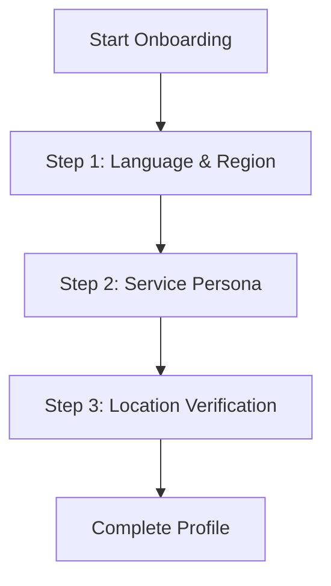

# User Onboarding API & Flow Documentation

This document describes the flow, API endpoints, request validation rules, and client-side integration guidelines required to implement the onboarding screens in the **JKWORLDS** mobile applications.

---

## 1. Onboarding Flow Overview

When a user signs in or registers on the mobile application, the app should inspect the `onboarding_completed` flag inside the profile/user data payload:
*   **If `onboarding_completed` is `true`**: Route the user directly to the main landing page/dashboard.
*   **If `onboarding_completed` is `false`**: Intercept the route and launch the **Onboarding Wizard** before permitting regular app usage.

The onboarding wizard gathers critical regional preferences, service preferences, and timezone/geocoding data to initialize the user's localized experience.

---

## 2. API Endpoints

### A. Fetch Onboarding Config & Defaults
`GET /api/onboarding`

Retrieves the lists of supported languages, countries, currencies, and timezones, along with recommended defaults dynamically resolved based on the request's locale and headers.

#### **Request Headers**
| Header | Value | Required | Description |
| :--- | :--- | :--- | :--- |
| `Authorization` | `Bearer <token>` | Yes | Sanctum personal access token. |
| `Accept` | `application/json` | Yes | Content formatting. |

#### **Example Request**
```http
GET /api/onboarding HTTP/1.1
Host: api.jkworlds.com
Authorization: Bearer 3|abc123xyz...
Accept: application/json
```

#### **Example Response**
```json
{
  "status": true,
  "message": "Onboarding configurations fetched successfully.",
  "data": {
    "languages": {
      "en": "English",
      "pcm": "Nigerian Pidgin"
    },
    "countries": {
      "AZ": { "name": "Azerbaijan", "currency": "AZN", "timezone": "Asia/Baku" },
      "BD": { "name": "Bangladesh", "currency": "BDT", "timezone": "Asia/Dhaka" },
      "DE": { "name": "Germany", "currency": "EUR", "timezone": "Europe/Berlin" },
      "FR": { "name": "France", "currency": "EUR", "timezone": "Europe/Paris" },
      "GB": { "name": "United Kingdom", "currency": "GBP", "timezone": "Europe/London" },
      "NG": { "name": "Nigeria", "currency": "NGN", "timezone": "Africa/Lagos" },
      "SA": { "name": "Saudi Arabia", "currency": "SAR", "timezone": "Asia/Riyadh" },
      "US": { "name": "United States", "currency": "USD", "timezone": "America/New_York" }
    },
    "defaults": {
      "preferred_language": "en",
      "preferred_country": "US",
      "preferred_currency": "USD",
      "preferred_timezone": "America/New_York"
    }
  }
}
```

---

### B. Submit Onboarding Preferences
`POST /api/onboarding`

Submits the selected preferences, updates the user's database profile, and marks `onboarding_completed` as `true`.

#### **Request Headers**
| Header | Value | Required | Description |
| :--- | :--- | :--- | :--- |
| `Authorization` | `Bearer <token>` | Yes | Sanctum personal access token. |
| `Content-Type` | `application/json` | Yes | Request payload format. |
| `Accept` | `application/json` | Yes | Content formatting. |

#### **Request Body Parameters**

| Parameter | Type | Required | Description | Constraints / Enums |
| :--- | :--- | :--- | :--- | :--- |
| `language` | `string` | Yes | Preferred application language. | Max 8 characters. (e.g. `en`, `pcm`) |
| `country` | `string` | Yes | Preferred country region (ISO two-letter code). | Exactly 2 characters. (e.g. `US`, `NG`) |
| `currency` | `string` | Yes | Preferred pricing currency. | Max 8 characters. (e.g. `USD`, `NGN`) |
| `timezone` | `string` | Yes | Standard Olsen timezone name. | Max 80 characters. (e.g. `Asia/Dubai`) |
| `role` | `string` | Yes | Selected service persona category. | Must be: `traveler`, `business`, or `chauffeur`. |
| `city` | `string` | No | Current city name. | Max 80 characters. |
| `latitude` | `double` | No | GPS latitude coordinate. | Must be a valid numeric latitude decimal. |
| `longitude` | `double` | No | GPS longitude coordinate. | Must be a valid numeric longitude decimal. |

#### **Example Request**
```http
POST /api/onboarding HTTP/1.1
Host: api.jkworlds.com
Authorization: Bearer 3|abc123xyz...
Content-Type: application/json
Accept: application/json

{
  "language": "en",
  "country": "US",
  "currency": "USD",
  "timezone": "America/New_York",
  "role": "traveler",
  "city": "New York",
  "latitude": 40.7128,
  "longitude": -74.0060
}
```

#### **Example Response (200 OK)**
```json
{
  "status": true,
  "message": "Onboarding completed successfully.",
  "data": {
    "user": {
      "id": 4,
      "name": "Jane Smith",
      "email": "jane@example.com",
      "preferred_language": "en",
      "preferred_country": "US",
      "preferred_currency": "USD",
      "preferred_timezone": "America/New_York",
      "preferred_service": "traveler",
      "city": "New York",
      "country": "US",
      "location_latitude": 40.7128,
      "location_longitude": -74.006,
      "onboarding_completed": true,
      "created_at": "2026-05-15T08:30:00.000000Z",
      "updated_at": "2026-06-24T10:18:42.000000Z"
    }
  }
}
```

---

## 3. Database Schema Mapping

When preferences are saved, the backend maps requests parameters to the following database columns on the `users` table:

*   `preferred_language` $\leftarrow$ `language`
*   `preferred_country` $\leftarrow$ `country` (forced to uppercase)
*   `preferred_currency` $\leftarrow$ `currency` (forced to uppercase)
*   `preferred_timezone` $\leftarrow$ `timezone`
*   `preferred_service` $\leftarrow$ `role`
*   `city` $\leftarrow$ `city`
*   `country` $\leftarrow$ `country` (forced to uppercase)
*   `location_latitude` $\leftarrow$ `latitude`
*   `location_longitude` $\leftarrow$ `longitude`
*   `onboarding_completed` $\leftarrow$ `true`

---

## 4. Mobile UX / Wizard Steps Guidelines

To ensure a seamless user experience, the mobile application should structure onboarding into three sequential screens:



### Step 1: Language & Region
1.  **Auto-detection**: Use the mobile device's system settings to auto-select default values for language, country, and timezone.
2.  **Selection Dropdowns**: Offer clean selectors populated using the lists from `GET /api/onboarding`. When the user selects a country, update the default currency and timezone automatically based on the country mapping database.

### Step 2: Booking Type (Service Persona)
*   Render three distinct visual cards with graphics/icons representing the service roles:
    1.  **Traveler**: Self-drive car rentals.
    2.  **Business**: Premium bookings, transfers, and chauffeur schedules.
    3.  **Chauffeur**: Dedicated chauffeur role.

### Step 3: Location Access
1.  Request native operating system permission to fetch coordinates (`latitude` / `longitude`).
2.  Perform reverse geocoding on the device (or retrieve it from location APIs) to pre-fill the `city` parameter. If location permissions are denied, allow the user to type their home city manually.
