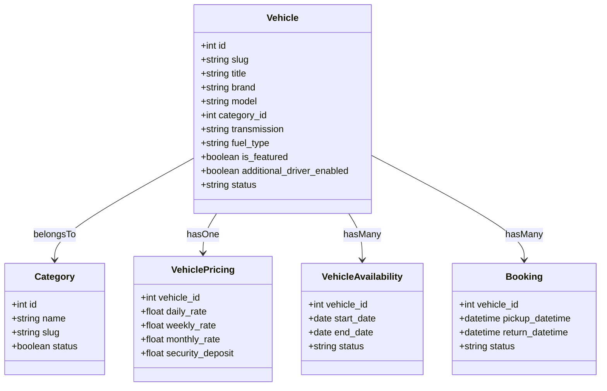

# Vehicle Listing and Vehicle Details API Documentation

This document outlines the API endpoints, query parameters, filtering logic, pagination structures, and detailed response schemas for integrating the vehicle listing and details features in **JKWORLDS**.

---

## 1. Endpoints Overview

All endpoints are prefix-grouped under the API namespace.

| Method | Endpoint | Description | Auth Required |
|:---|:---|:---|:---|
| **GET** | `/api/vehicles` | Paginated listing of all active vehicles. Supports searching, filtering, and sorting. | No |
| **GET** | `/api/vehicles/{id_or_slug}` | Complete details of a specific active vehicle by its ID or slug. | No |
| **GET** | `/api/vehicles/filters` | Dynamic filter options (categories, fuel types, transmissions, sorting, etc.) to populate frontend UI dropdowns. | No |
| **GET** | `/api/categories/{id_or_slug}/vehicles` | Paginated listing of active vehicles within a specific category. | No |

### Global Header Support: Currency Conversion
The API supports dynamic currency conversion and localized price formatting across all listing and detail endpoints. Clients can send a custom header to specify the target currency:

*   **Header Name**: `Currency`
*   **Type**: `string`
*   **Description**: Optional. The ISO 3-letter currency code (e.g., `AED`, `USD`, `EUR`).
*   **Behavior**: If the header is provided and matches an active currency in the system, all pricing values (daily, weekly, monthly rates, security deposits, protection plans, add-ons, etc.) are dynamically converted and formatted with the corresponding currency symbol and layout rules. If not provided or invalid, the API falls back to the system's default currency.

---

## 2. API Endpoints Reference

### A. List Active Vehicles
`GET /api/vehicles`

Retrieves a paginated list of active vehicles. Supports a wide array of filters.

#### **Request Headers**

| Header | Type | Required | Description | Example |
| :--- | :--- | :--- | :--- | :--- |
| `Currency` | `string` | No | Target currency for dynamic price conversion. | `AED` |

#### **Query Parameters**

| Parameter / Alias | Type | Default | Description | Example |
| :--- | :--- | :--- | :--- | :--- |
| `search` | `string` | *None* | Fuzzy search matches on `title`, `brand`, `model`, `plate_number`, and category `name`/`slug`. | `Toyota` |
| `category_id` \| `category` | `int` \| `string` | `all` | Filter by Category ID or Category slug/name. Resolves to the correct category ID. | `2` or `suv` |
| `service_type` | `string` | `all` | Filter by chauffeur requirement: `self_drive` (driver not required) or `chauffeur` (driver required/enabled). | `self_drive` |
| `transmission` | `string` | `all` | Gearbox type: `auto` (or `automatic`), `manual`, or `all`. | `auto` |
| `fuel_type` | `string` | `all` | Fuel type: `petrol`, `diesel`, `hybrid`, `electric`, or `all`. | `hybrid` |
| `featured` | `boolean` | `false` | Set to `true` or `1` to fetch only featured listings. | `1` |
| `sort` | `string` | `top_rated` | Sort direction/field. Supports aliases: `price`/`price_low` (Price Low to High), `-price`/`price_high` (Price High to Low), `rating`/`-rating`/`top-rated`/`top_rated` (Top Rated), `newest` (Newest). | `price_low` |
| `per_page` | `integer` | `12` | Controls page size limit. | `15` |
| `page` | `integer` | `1` | Page offset number. | `2` |

#### **Example Request**
```http
GET /api/vehicles?search=SUV&transmission=auto&sort=price_low&per_page=2 HTTP/1.1
Host: api.jkworlds.com
Accept: application/json
Currency: USD
```

#### **Example Response**
```json
{
  "status": true,
  "message": "Vehicles fetched successfully.",
  "currency": "USD",
  "filters": {
    "search": "SUV",
    "category_id": null,
    "service_type": "all",
    "transmission": "auto",
    "fuel_type": "all",
    "featured": false,
    "sort": "price_low"
  },
  "data": [
    {
      "id": 12,
      "slug": "toyota-rav4-2024",
      "title": "Toyota RAV4 2024",
      "brand": "Toyota",
      "model": "RAV4",
      "year": 2024,
      "plate_number": "DXB-7789",
      "image": "https://api.jkworlds.com/storage/uploads/cars/rav4-front.jpg",
      "is_featured": true,
      "service_type": "self_drive",
      "service_type_label": "Self Drive",
      "category": {
        "id": 3,
        "name": "SUV",
        "slug": "suv"
      },
      "specs": {
        "seats": 5,
        "doors": 5,
        "transmission": "auto",
        "transmission_label": "Automatic",
        "fuel_type": "hybrid",
        "fuel_type_label": "Hybrid",
        "mileage": 12000
      },
      "rating": {
        "average": 4.8,
        "count": 14
      },
      "pricing": {
        "daily_rate": 150.00,
        "daily_rate_formatted": "$150.00",
        "total_price": 150.00,
        "total_price_formatted": "$150.00",
        "currency": "USD"
      },
      "features": [
        {
          "id": 1,
          "name": "Bluetooth",
          "icon": "https://api.jkworlds.com/assets/icons/bluetooth.svg"
        },
        {
          "id": 4,
          "name": "Backup Camera",
          "icon": "https://api.jkworlds.com/assets/icons/camera.svg"
        }
      ],
      "created_at": "2026-05-15T08:30:00Z",
      "updated_at": "2026-06-20T12:00:00Z"
    }
  ],
  "links": {
    "first": "https://api.jkworlds.com/api/vehicles?page=1",
    "last": "https://api.jkworlds.com/api/vehicles?page=5",
    "prev": null,
    "next": "https://api.jkworlds.com/api/vehicles?page=2"
  },
  "meta": {
    "current_page": 1,
    "from": 1,
    "last_page": 5,
    "links": [
      {
        "url": null,
        "label": "&laquo; Previous",
        "active": false
      },
      {
        "url": "https://api.jkworlds.com/api/vehicles?page=1",
        "label": "1",
        "active": true
      },
      {
        "url": "https://api.jkworlds.com/api/vehicles?page=2",
        "label": "2",
        "active": false
      }
    ],
    "path": "https://api.jkworlds.com/api/vehicles",
    "per_page": 2,
    "to": 2,
    "total": 10
  }
}
```

---

### B. Get Vehicle Details
`GET /api/vehicles/{id_or_slug}`

Retrieves complete details of an active vehicle, including specifications, long-term pricing, rental rules, availability calendars, similar recommendations, and reviews.

#### **Request Headers**

| Header | Type | Required | Description | Example |
| :--- | :--- | :--- | :--- | :--- |
| `Currency` | `string` | No | Target currency for dynamic price conversion. | `AED` |

#### **URI Parameters**

| Parameter | Type | Required | Description | Example |
| :--- | :--- | :--- | :--- | :--- |
| `id_or_slug` | `string` \| `integer` | Yes | The ID of the vehicle or its unique URL slug identifier. | `toyota-rav4-2024` or `12` |

#### **Example Request**
```http
GET /api/vehicles/toyota-rav4-2024 HTTP/1.1
Host: api.jkworlds.com
Accept: application/json
Currency: USD
```

#### **Example Response**
```json
{
  "status": true,
  "message": "Vehicle details fetched successfully.",
  "data": {
    "id": 12,
    "slug": "toyota-rav4-2024",
    "title": "Toyota RAV4 2024",
    "brand": "Toyota",
    "model": "RAV4",
    "year": 2024,
    "plate_number": "DXB-7789",
    "image": "https://api.jkworlds.com/storage/uploads/cars/rav4-front.jpg",
    "is_featured": true,
    "service_type": "self_drive",
    "service_type_label": "Self Drive",
    "category": {
      "id": 3,
      "name": "SUV",
      "slug": "suv"
    },
    "specs": {
      "seats": 5,
      "doors": 5,
      "transmission": "auto",
      "transmission_label": "Automatic",
      "fuel_type": "hybrid",
      "fuel_type_label": "Hybrid",
      "mileage": 12000
    },
    "rating": {
      "average": 4.8,
      "count": 1
    },
    "pricing": {
      "daily_rate": 150.00,
      "daily_rate_formatted": "$150.00",
      "total_price": 150.00,
      "total_price_formatted": "$150.00",
      "currency": "USD"
    },
    "features": [
      {
        "id": 1,
        "name": "Bluetooth",
        "icon": "https://api.jkworlds.com/assets/icons/bluetooth.svg"
      }
    ],
    "description": "The 2024 Toyota RAV4 Hybrid is comfortable, fuel-efficient, and spacious. Ideal for city driving or weekend getaways.",
    "color": "Gray",
    "make": {
      "id": 1,
      "name": "Toyota"
    },
    "vehicle_model": {
      "id": 5,
      "name": "RAV4"
    },
    "vehicle_color": {
      "id": 2,
      "name": "Slate Gray"
    },
    "gallery": [
      "https://api.jkworlds.com/storage/uploads/cars/rav4-front.jpg",
      "https://api.jkworlds.com/storage/uploads/cars/rav4-interior.jpg",
      "https://api.jkworlds.com/storage/uploads/cars/rav4-back.jpg"
    ],
    "pricing_details": {
      "weekly_rate": 950.00,
      "weekly_rate_formatted": "$950.00",
      "monthly_rate": 3500.00,
      "monthly_rate_formatted": "$3,500.00",
      "chauffeur_rate_per_day": 50.00,
      "chauffeur_rate_per_day_formatted": "$50.00",
      "security_deposit": 500.00,
      "security_deposit_formatted": "$500.00",
      "extra_km_charge": 0.50,
      "extra_km_charge_formatted": "$0.50",
      "overtime_charge_per_hour": 20.00,
      "overtime_charge_per_hour_formatted": "$20.00"
    },
    "security_deposit": {
      "amount": 500.00,
      "amount_formatted": "$500.00",
      "description": "Refundable security deposit captured upon pick up and returned 14 days after vehicle return."
    },
    "cancellation": {
      "title": "Flexible Cancellation",
      "description": "Free cancellation up to 48 hours prior to reservation start date."
    },
    "additional_driver": {
      "enabled": true,
      "price_type": "flat",
      "price_value": 15.00,
      "price_value_formatted": "$15.00"
    },
    "mileage_policies": [
      {
        "id": 1,
        "title": "250 km daily limit included. Extra mileage costs $0.50/km."
      }
    ],
    "rental_requirements": [
      {
        "id": 1,
        "title": "Minimum age of 21 years old"
      },
      {
        "id": 2,
        "title": "Valid International Driving License"
      }
    ],
    "included_items": [
      {
        "id": 1,
        "title": "Third-Party Liability Insurance"
      },
      {
        "id": 2,
        "title": "Roadside Assistance"
      }
    ],
    "protection_plans": [
      {
        "id": 1,
        "title": "Collision Damage Waiver (CDW)",
        "description": "Reduces liability to $500 in case of accident.",
        "price_type": "daily",
        "price_value": 20.00,
        "price_value_formatted": "$20.00",
        "price_label": "$20.00 / day"
      }
    ],
    "rental_addons": [
      {
        "id": 2,
        "title": "GPS Navigator",
        "description": "Handheld GPS map support system.",
        "price_type": "flat",
        "price_value": 30.00,
        "price_value_formatted": "$30.00",
        "price_label": "$30.00",
        "is_checkbox": true
      },
      {
        "id": 3,
        "title": "Child Seat",
        "description": "Approved child booster seat.",
        "price_type": "daily",
        "price_value": 10.00,
        "price_value_formatted": "$10.00",
        "price_label": "$10.00 / day",
        "is_checkbox": false
      }
    ],
    "reviews": [
      {
        "id": 8,
        "rating": 5,
        "comment": "Excellent ride! Car was extremely clean and customer service was prompt.",
        "user": {
          "id": 4,
          "name": "Jane Smith",
          "image": "https://api.jkworlds.com/storage/uploads/users/jane-smith.png"
        },
        "replies": [
          {
            "id": 2,
            "reply": "Thank you for renting with us, Jane! We look forward to seeing you again.",
            "admin": {
              "id": 1,
              "name": "Super Admin"
            },
            "created_at": "2026-06-18T10:15:00Z"
          }
        ],
        "created_at": "2026-06-17T14:20:00Z",
        "created_at_formatted": "Jun 17, 2026"
      }
    ],
    "unavailable_dates": [
      {
        "from": "2026-07-01",
        "to": "2026-07-05",
        "label": "1 July 2026 - 5 July 2026"
      },
      {
        "from": "2026-07-15",
        "to": "2026-07-15",
        "label": "15 July 2026"
      }
    ],
    "similar_vehicles": [
      {
        "id": 15,
        "slug": "honda-crv-2023",
        "title": "Honda CR-V 2023",
        "brand": "Honda",
        "model": "CR-V",
        "year": 2023,
        "plate_number": "DXB-4122",
        "image": "https://api.jkworlds.com/storage/uploads/cars/crv-front.jpg",
        "is_featured": false,
        "service_type": "self_drive",
        "service_type_label": "Self Drive",
        "category": {
          "id": 3,
          "name": "SUV",
          "slug": "suv"
        },
        "specs": {
          "seats": 5,
          "doors": 5,
          "transmission": "auto",
          "transmission_label": "Automatic",
          "fuel_type": "petrol",
          "fuel_type_label": "Petrol",
          "mileage": 28000
        },
        "rating": {
          "average": 4.6,
          "count": 8
        },
        "pricing": {
          "daily_rate": 130.00,
          "daily_rate_formatted": "$130.00",
          "total_price": 130.00,
          "total_price_formatted": "$130.00",
          "currency": "USD"
        },
        "features": [],
        "created_at": "2026-04-10T09:00:00Z",
        "updated_at": "2026-06-19T11:00:00Z"
      }
    ],
    "created_at": "2026-05-15T08:30:00Z",
    "updated_at": "2026-06-20T12:00:00Z"
  }
}
```

---

### C. Fetch Filter Options
`GET /api/vehicles/filters`

Returns a structural list of configuration arrays (transmission options, fuel types, sort options, active category options) used to populate client filter layouts.

#### **Example Request**
```http
GET /api/vehicles/filters HTTP/1.1
Host: api.jkworlds.com
Accept: application/json
```

#### **Example Response**
```json
{
  "status": true,
  "message": "Vehicle filter options fetched successfully.",
  "data": {
    "service_type": [
      { "value": "all", "label": "All Vehicles" },
      { "value": "self_drive", "label": "Self Drive" },
      { "value": "chauffeur", "label": "Chauffeur" }
    ],
    "category_id": [
      { "value": null, "label": "All", "image": null },
      { "value": 1, "label": "Luxury Sedan", "image": "https://api.jkworlds.com/storage/uploads/categories/sedan.jpg" },
      { "value": 2, "label": "Economy hatchback", "image": "https://api.jkworlds.com/storage/uploads/categories/hatchback.jpg" },
      { "value": 3, "label": "SUV", "image": "https://api.jkworlds.com/storage/uploads/categories/suv.jpg" }
    ],
    "transmission": [
      { "value": "all", "label": "All" },
      { "value": "auto", "label": "Automatic" },
      { "value": "manual", "label": "Manual" }
    ],
    "fuel_type": [
      { "value": "all", "label": "All" },
      { "value": "petrol", "label": "Petrol" },
      { "value": "diesel", "label": "Diesel" },
      { "value": "hybrid", "label": "Hybrid" },
      { "value": "electric", "label": "Electric" }
    ],
    "sort": [
      { "value": "top_rated", "label": "Top Rated" },
      { "value": "price_low", "label": "Price Low to High" },
      { "value": "price_high", "label": "Price High to Low" },
      { "value": "newest", "label": "Newest" }
    ]
  }
}
```

---

### D. Get Vehicles By Category
`GET /api/categories/{id_or_slug}/vehicles`

A convenient helper endpoint that automatically maps queries to a specific active category, returning a paginated vehicle resource collection.

#### **Request Headers**

| Header | Type | Required | Description | Example |
| :--- | :--- | :--- | :--- | :--- |
| `Currency` | `string` | No | Target currency for dynamic price conversion. | `AED` |

#### **URI Parameters**

| Parameter | Type | Required | Description | Example |
| :--- | :--- | :--- | :--- | :--- |
| `id_or_slug` | `string` \| `integer` | Yes | The ID of the category or its slug identifier. | `suv` or `3` |

#### **Query Parameters**
Accepts the same search, sorting, filtering, and page parameters as `GET /api/vehicles`. The response structure, including pagination format and the root-level `currency` field, matches the `GET /api/vehicles` endpoint.

---

## 3. Core Database Models & Schema Relationships

The database implementation utilizes Eloquent relationships to dynamically construct the listing models:



---

## 4. Frontend Integration Guidelines

### 1. Handling Dates & Calendars
To prevent booking overlapping, parse the `unavailable_dates` array from `GET /api/vehicles/{id_or_slug}`.
- Format is `{ from: "YYYY-MM-DD", to: "YYYY-MM-DD" }`.
- In Flutter (`table_calendar`) or React (`react-datepicker`), iterate through these ranges and set them as disabled/unselectable dates in the calendar picker instance.

### 2. Search Debouncing
Always debounce input search fields on the frontend (e.g., 300-500ms delay) before invoking `GET /api/vehicles?search=...` to reduce API load and improve application responsiveness.

### 3. Pagination Handling
Ensure that list view instances (infinite scroll list/grids) read the `meta.current_page` and `meta.last_page` parameters. Append pages incrementally (`?page=2`, `?page=3`) instead of overwriting the previous loaded state, unless an explicit filter resets.
